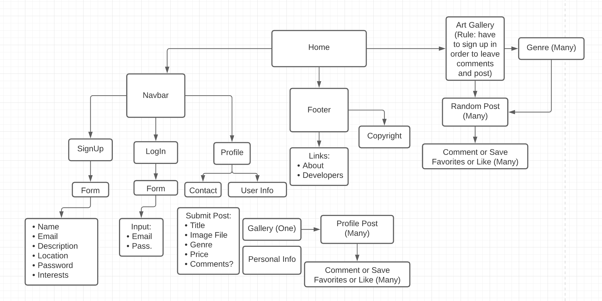

# My-Mini-Gallery

## What the app will do

    1. AS a USER I want to share my artwork (with description) either to my personal account or to the public.

    2. AS a USER I want leave comments and suggestions to artwork

    3. AS a USER I want add artwork to "favorites"

    4. AS a USER I want to visit artist's portfolio page

    5. AS a USER I want to browse diff categories

    6. AS a USER I want to sign up and log in using my personal info (email, password)

## What technologies you expect your app to implement.
    Front End:
    1. ReactJS (React Hooks, Router)
    2. Bootstrap

    Back End:
    1. Node
    2. Express
    3. Mongo/Mongoose
    4. Multer (Image upload)

    Apis:
    1. Some artwork api
    2. Email api

    Cloud:
    5. AWS services
    
    Others...

## Who will be responsible for each part of the app.

    Hanh - Front End (React, Bootstrap, Styling)
    Greg - Back End (React, MVC)
    Jasur - AWS, Mongo/Mongoose
    Jenni - Front End (React, Bootstrap, Styling)
    Amal - Artwork API, Email API, Back End (MVC)

## Who will be responsible for each part of Deliverables #1.

    1. Why intended application is valuable
    
    Overview of the intended application and WHY you feel it's valuable?

    The overall intention of the application is to provide a space for artists to share their artwork. If it's drawings, paintings, designs, sculptures, or whatever form it might take, this website will help them get it in front of an audience and show it to others. Anything they create that is worth sharing can be done so with our application.

    This website will not only allow people to share their own creative work among each other, but to also comment or favorite certain pieces and follow artists they enjoy as well. The aim will be to encourage a community of creative minds to learn from one another, possibly collaborate, and hopefully better their skills as well.

    The final use case, and potentially the most valuable, will be for artists to use our application to venture into the professional world. By making an account and populating it with one's work, an artist can build up a portfolio and hopefully use it to promote themselves, build a following, sell their creations, and maybe even land a studio job. 

    2. Wireframe - Hanh

    3. Breakdown of Roles by group member - Done

    4. Schedule of completion of tasks - Team

    5. Kanban board - Amal

## Appendix:

    ### Email-API - https://postmarkapp.com/email-api, https://nodemailer.com/about/

    ### Application Diagram 